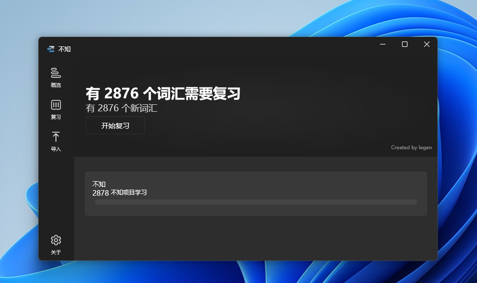
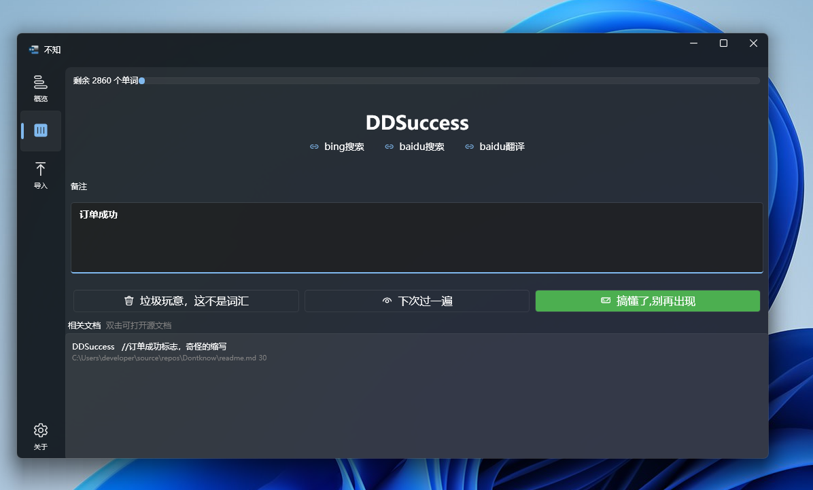

# DontKnow

[中文](/readme.md)|
[English](/readme.en.md)

> Knowing is Knowing,Not Knowing is not knowing

Use **DontKnow** to bring together unfamiliar words in the project in one place and solve it


 

# How to Use
1. Click Import and select the import project
2. Click Review every day to review unfamiliar vocabulary and make notes until you are familiar with all vocabulary
  

# General
This is an app for quickly finding unfamiliar terms in your projects, providing periodic review and one-click search


# Why

I have seen many questions like this:
- How to learn programming without knowing English at all?
- Is it hard to learn programming without knowing English?

Indeed, when I took over a new project, I was unclear about the meaning of the code.

I also thought it was a question of not being familiar with English.

Of course, I have read some articles about common English vocabulary of programmers, but it doesn't work.

Until I summarize the variable names I encountered, (there are changes, roughly this is what it means)

```csharp

nkstchart //Nyquist curve, domain-specific language

IsChengong //Its meaning Success, Which combines two languages

DDSuccess   //Its meaning Order Success, which  has weird shorthand
```

Non-standard naming, cured my low blood pressure for many years

The more projects you handle, the more or less you may encounter such "terms". I will not evaluate whether such naming is reasonable here (of course it is not reasonable)

But the real problem I need to face is how to take over this project as soon as possible when the project already has all kinds of strange naming terms

In the past, after spending a lot of time reading these projects over and over again, I gradually understood the meaning of the predecessors.

Imagine if I took on this project and picked out all the unfamiliar words and devoted 10-20 minutes a day to the unfamiliar terminology.

It may be possible to alleviate this problem to some extent.

This is the original intention


# road map
1. multi Language support, which only support CSharp
2. Store data with sqlite
3. Familiar words will be ignored in new projects
4. localization