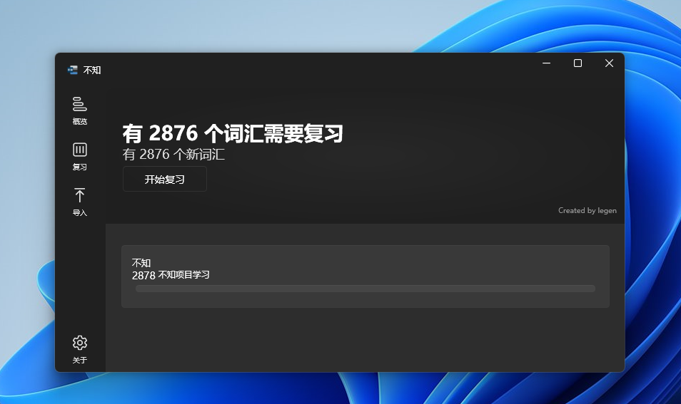
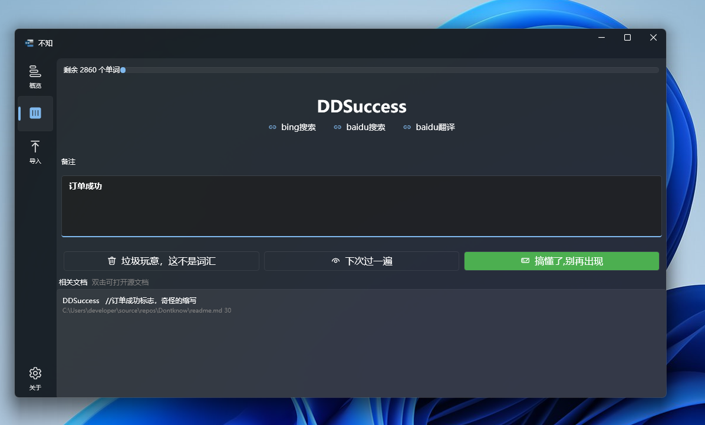

# 不知
[中文](/readme.md)|
[English](/readme.en.md)

> 知之为知之，不知为不知

用 **不知** 快速搞定自己不熟悉的术语

 

## 如何使用
1. 点击导入，选择导入项目
2. 点击复习栏，复习不熟悉的词汇，并做好备注
  

## 概述

这是一个用于快速找到你的项目中不熟悉的术语，提供周期复习以及便捷的搜索方式的应用


## 为什么做他

我看见过很多这样的提问：
- 在英语完全不懂的情况下如何学编程？
- Is it hard to learn programming without knowing English?


确实我在接手新项目的时候，一度不清楚他想表达什么意思
我也会觉得这是不熟悉英语的问题

我当然看过一些程序员常用英语之类的文章

直到我总结一下我遇到的变量名, （有改动，大致是这个意思）
```csharp

nkstchart //奈奎斯特曲线图， 特定领域的术语

IsChengong //是成功了，英文加拼音

DDSuccess   //订单成功标志，奇怪的缩写
```
治好了我多年的低血压

经手的项目越多，可能或多或少会遇到这样的“术语”，在这里不评价这样命名是否合理（当然不合理啊喂）

但我需要面临的现实问题是，项目中已经是由各种奇怪命名术语的情况下，如何尽快接手这个项目


以往这些项目，在我一遍又一遍翻阅几次后，逐渐搞懂了前人的意思

设想一下
如果我在接手这个项目时，就把所有不熟悉的词汇挑出来，每天花10-20分钟专门攻克不熟悉的术语。

也许能够一定程度上解决这个问题。

这就是不知的初衷


## 路线图
1. 多语言支持
2. 数据持久化迁移到sqlite
3. 已熟悉的单词，将会在新的项目中忽略
4. 界面国际化

